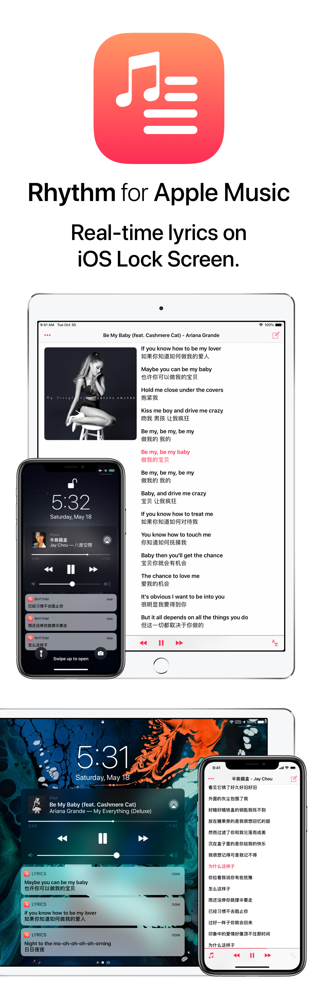

# Rhythm
Real-time lyrics on iOS Lock Screen. Made for Apple Music.

## Install…

### via TestFlight
Tap the [Test Invitation Link](https://testflight.apple.com/join/PGzq9arn) on your iOS device.

### via Xcode
1. Clone the project
2. Open the project using Xcode 11 or later
3. Set Development Team to your team
4. Configure App Group settings by Find and Replace all of the occurrence "group.com.jonny.lyrics" with your own App Group identifier
5. Build & run

## Open Source Library
[LyricsProvider](https://github.com/ddddxxx/LyricsProvider)

## Disclaimer
All lyrics are property and copyright of their owners.

## GNU General Public License
Rhythm <https://github.com/JunyuKuang/Rhythm>

Copyright (C) 2019  Junyu Kuang

This program is free software: you can redistribute it and/or modify
it under the terms of the GNU General Public License as published by
the Free Software Foundation, either version 3 of the License, or
(at your option) any later version.

This program is distributed in the hope that it will be useful,
but WITHOUT ANY WARRANTY; without even the implied warranty of
MERCHANTABILITY or FITNESS FOR A PARTICULAR PURPOSE.  See the
GNU General Public License for more details.
    
You should have received a copy of the GNU General Public License
along with this program.  If not, see <http://www.gnu.org/licenses/>.

